# Application Layer - Class Diagram

This layer orchestrates bot behaviors, task scheduling, and game automation workflows.

```mermaid
classDiagram
    %% Task Management
    class TaskScheduler {
        -PriorityQueueExc execution_queue
        -PriorityQueuePrio priority_queue
        -Lock lock
        +add_task(task)
        +run()
        +pause()
        +resume()
        +get_next_task() Task
    }
    
    class PriorityQueueExc {
        -list queue
        +add(task, priority, execution_time)
        +pop() tuple
        +peek() tuple
        +is_empty() bool
    }
    
    class PriorityQueuePrio {
        -list queue
        +add(task, priority, execution_time)
        +pop() tuple
        +peek() tuple
        +is_empty() bool
    }
    
    %% Base Task
    class BaseTask {
        <<Abstract>>
        +execute()*
        +get_priority_level()* int
        +get_requeue_delay() int
    }
    
    %% Bot Stations/Tasks
    class GachaStation {
        -str name
        -str teleporter_name
        -str direction
        +execute()
        +get_priority_level() int
        +get_requeue_delay() int
    }
    
    class PegoStation {
        -str name
        -str teleporter_name
        -int delay
        +execute()
        +get_priority_level() int
        +get_requeue_delay() int
    }
    
    class RenderStation {
        +execute()
        +get_priority_level() int
        +get_requeue_delay() int
    }
    
    class SnailPhoenix {
        -str name
        -str teleporter_name
        -str direction
        -str depo_tp
        +execute()
        +get_priority_level() int
        +get_requeue_delay() int
    }
    
    class PauseTask {
        +execute()
        +get_priority_level() int
        +get_requeue_delay() int
    }
    
    %% Bot Logic Modules
    class GachaBot {
        +collection(metadata)
        +drop_off(metadata)
        +iguanadon_gacha(metadata)
        +snail_pheonix_collection(metadata)
    }
    
    class PegoBot {
        +pego_pickup(metadata)
    }
    
    class DepositBot {
        +open_crystals()
        +dedi_deposit(height)
        +vault_deposit(items, metadata)
        +drop_useless()
        +depo_grinder(metadata)
        +collect_grindables(metadata)
        +vaults(metadata)
        +deposit_all(metadata)
    }
    
    class IguanadonBot {
        +berry_collection()
        +berry_station()
        +seed(type)
    }
    
    class RenderBot {
        +bool render_flag
        +enter_tekpod()
        +leave_tekpod()
    }
    
    class BotConfig {
        <<Config>>
        +int max_gacha_attempts
        +int collection_timeout
        +dict station_settings
    }
    
    %% Crafting System
    class CraftingCalculator {
        +HeavyTurret
    }
    
    class HeavyTurret {
        -int metal_cost
        -int poly_cost
        -int elec_cost
        -int paste_cost
        -int metal
        -int poly
        -int elec
        -int paste
        +calculate() int
        +craft()
    }
    
    class ChemBench {
        +craft_gunpowder()
        +craft_sparkpowder()
    }
    
    class Forge {
        +indi_forge(metadata)
    }
    
    class Replicator {
        +craft_item(item_name)
    }
    
    class ResourceChecks {
        +check_resources(required) bool
        +get_vault_resources() dict
    }
    
    %% Reconnect System
    class ReconnectSystem {
        -str server_number
        +check_disconnected() bool
        +rejoin_server()
    }
    
    class MainMenu {
        +is_open() bool
        +disconnect() bool
        +join_last()
        +enter_menu()
    }
    
    class JoinMenu {
        +is_open() bool
        +enter_menu()
        +exit_menu()
    }
    
    class MultiplayerMenu {
        +is_open() bool
        +search_server(server_name)
        +join_server()
    }
    
    class ReconUtils {
        +check_template(item, threshold) bool
        +check_template_no_bounds(item, threshold) bool
        +template_sleep(template, threshold, sleep_amount) bool
        +window_still_open(template, threshold, timeout) bool
    }
    
    class CrashDetection {
        +is_crashed() bool
        +restart_game()
    }
    
    %% Relationships - Task Management
    TaskScheduler --> PriorityQueueExc : uses
    TaskScheduler --> PriorityQueuePrio : uses
    TaskScheduler --> BaseTask : schedules
    
    BaseTask <|-- GachaStation
    BaseTask <|-- PegoStation
    BaseTask <|-- RenderStation
    BaseTask <|-- SnailPhoenix
    BaseTask <|-- PauseTask
    
    %% Relationships - Bot Tasks to Logic
    GachaStation --> GachaBot : executes
    GachaStation --> DepositBot : deposits
    PegoStation --> PegoBot : executes
    PegoStation --> DepositBot : deposits
    RenderStation --> RenderBot : executes
    SnailPhoenix --> GachaBot : collects
    SnailPhoenix --> DepositBot : deposits
    
    GachaBot --> IguanadonBot : uses for seeding
    GachaBot --> BotConfig : uses
    
    %% Relationships - Crafting
    CraftingCalculator --> HeavyTurret : creates
    ChemBench --> ResourceChecks : checks resources
    Forge --> ResourceChecks : checks resources
    Replicator --> ResourceChecks : checks resources
    
    %% Relationships - Reconnect
    ReconnectSystem --> MainMenu : navigates
    ReconnectSystem --> JoinMenu : navigates
    ReconnectSystem --> MultiplayerMenu : navigates
    ReconnectSystem --> ReconUtils : uses
    ReconnectSystem --> CrashDetection : checks
    
    MainMenu --> ReconUtils : uses
    JoinMenu --> ReconUtils : uses
    MultiplayerMenu --> ReconUtils : uses
    
    %% Notes
    note for TaskScheduler "Dual-queue system:\n- Execution time queue\n- Priority queue"
    note for BaseTask "Priority levels:\n1=Low, 2=High, 3=Medium, 4=Ultra"
    note for GachaBot "Main farming logic\nHandles 145-seed iguanadon method"
    note for ReconnectSystem "Automatic recovery\nNavigates full menu system"
```

## Component Details

### Task Management

#### TaskScheduler
- **Purpose**: Central task orchestration with priority and time-based execution
- **Queues**:
  - **Execution Queue**: Tasks ordered by next execution time
  - **Priority Queue**: Immediate tasks ordered by priority
- **Thread Safety**: Uses locks for concurrent access
- **Singleton Pattern**: Ensures single scheduler instance

#### BaseTask (Abstract)
- **Purpose**: Base class for all bot tasks
- **Required Methods**:
  - `execute()`: Task implementation
  - `get_priority_level()`: Priority (1=Low, 2=High, 3=Medium, 4=Ultra)
  - `get_requeue_delay()`: Seconds until next execution

### Bot Tasks

#### GachaStation
- **Priority**: 3 (Medium)
- **Delay**: 13200s (3.67 hours)
- **Workflow**: Teleport → Seed Iguanadon → Collect Gacha → Deposit

#### PegoStation
- **Priority**: 2 (Highest)
- **Delay**: Based on configuration
- **Workflow**: Teleport → Collect Crystals → Deposit
- **Note**: Highest priority to prevent Pego slot capping

#### RenderStation
- **Priority**: 1 (Lowest)
- **Delay**: Based on render flag
- **Purpose**: Enter/exit Tek Sleeping Pod for food/water regeneration

#### SnailPhoenix
- **Priority**: 4 (Ultra)
- **Delay**: 13200s (3.67 hours)
- **Purpose**: Collect from Snails/Phoenix (cementing paste, organic polymer)

### Bot Logic Modules

#### GachaBot
- **Purpose**: Gacha creature farming automation
- **Key Method**: `iguanadon_gacha()` - 145-seed method
- **Process**:
  1. Seed iguanadon with berries (145 stacks)
  2. Take seeds from iguanadon
  3. Feed seeds to gacha
  4. Collect gacha production
  5. Deposit resources

#### PegoBot
- **Purpose**: Collect crystals from Pegomastax creatures
- **Simple**: Quick collection and deposit

#### DepositBot
- **Purpose**: Resource deposit automation
- **Methods**:
  - `dedi_deposit()`: Dedicated storage deposit
  - `vault_deposit()`: Vault deposit with specific items
  - `depo_grinder()`: Grinder deposit for unwanted items
  - `open_crystals()`: Auto-open crystal stacks from hotbar

#### IguanadonBot
- **Purpose**: Iguanadon seeding automation
- **Methods**:
  - `seed()`: Transfer berries, activate iguanadon, collect seeds
  - `berry_collection()`: Collect berries from iguanadon
  - `berry_station()`: External berry farming

#### RenderBot
- **Purpose**: Tek Sleeping Pod management
- **Purpose**: Regenerate food/water in Tek Pod
- **Flag-based**: Global render_flag triggers pod entry

### Crafting System

#### CraftingCalculator
- **Purpose**: Calculate craftable quantities
- **Example**: HeavyTurret - calculates based on available resources

#### ARB Modules (Automated Resource Bot)
- **ChemBench**: Gunpowder, sparkpowder crafting
- **Forge**: Industrial forge automation
- **Replicator**: Advanced item crafting
- **ResourceChecks**: Validate sufficient resources before crafting

### Reconnect System

#### ReconnectSystem
- **Purpose**: Automatic game reconnection on disconnect
- **Features**:
  - Crash detection
  - Menu navigation
  - Server search and join
  - Session recovery

#### Menu Navigation
- **MainMenu**: Start screen navigation
- **JoinMenu**: Join game menu
- **MultiplayerMenu**: Server selection and search

#### ReconUtils
- **Purpose**: Reconnect-specific template matching
- **Different from main template module**: Uses different ROI regions

#### CrashDetection
- **Purpose**: Detect game crashes
- **Action**: Restart game process
