# ARK Gacha Bot - Class Diagram

## Python to C# Migration Checklist

### Core Infrastructure
- [x] ScreenCapture (screen.py) → ScreenCapture.cs
- [x] WindowManager (windows.py) → WindowManager.cs
- [x] TemplateMatching (template.py, recon_utils.py) → TemplateMatching.cs
- [ ] InputManager (utils.py) → (Not yet created)
- [x] LocalPlayer (local_player.py) → (Functionality in Configuration/BotSettings.cs)
- [ ] VariableManager (variables.py) → (Not yet created)

### Configuration & Settings
- [ ] Settings (settings.py) → Configuration/BotSettings.cs (partial)

### Reconnection System
- [x] CrashHandler (reconnect/crash.py) → ArkWindow/CrashHandler.cs
- [x] ReconnectSystem (reconnect/start.py) → ArkWindow/ReconnectSystem.cs
- [x] MainMenu (reconnect/main_menu.py) → ArkWindow/MainMenu.cs
- [x] MultiplayerMenu (reconnect/multiplayer_menu.py) → ArkWindow/MultiplayerMenu.cs
- [x] ReconUtils (reconnect/recon_utils.py) → TemplateMatching.cs (merged)

### Task Management
- [ ] PriorityQueueExecution (task_manager.py: priority_queue_exc) → Tasks/PriorityQueueExecution.cs (partial)
- [ ] PriorityQueuePriority (task_manager.py: priority_queue_prio) → Tasks/PriorityQueuePriority.cs (partial)
- [ ] TaskScheduler (task_manager.py: task_scheduler) → (Not yet created)

### Bot Tasks
- [ ] BaseTask (bot/stations.py: base_task) → (Not yet created)
- [ ] GachaStation (bot/stations.py: gacha_station) → (Not yet created)
- [ ] PegoStation (bot/stations.py: pego_station) → (Not yet created)
- [ ] RenderStation (bot/stations.py: render_station) → (Not yet created)
- [ ] SnailPheonix (bot/stations.py: snail_pheonix) → (Not yet created)
- [ ] PauseTask (bot/stations.py: pause) → (Not yet created)

### ASA Game Interaction
- [ ] Inventory (ASA/inventories/inventory.py) → (Not yet created)
- [ ] CheckBuffs (ASA/player/buffs.py) → (Not yet created)
- [ ] Console (ASA/player/console.py) → (Not yet created)
- [ ] PlayerInventory (ASA/player/player_inventory.py) → (Not yet created)
- [ ] PlayerState (ASA/player/player_state.py) → (Not yet created)
- [ ] Tribelog (ASA/player/tribelog.py) → (Not yet created)
- [ ] StationMetadata (ASA/stations/custom_stations.py) → (Not yet created)
- [ ] Bed (ASA/structures/bed.py) → (Not yet created)
- [ ] StructureInventory (ASA/structures/inventory.py) → (Not yet created)
- [ ] Teleporter (ASA/structures/teleporter.py) → (Not yet created)
- [ ] ShoulderMounts (ASA/dinosaurs/shoulder_mounts.py) → (Not yet created)

### Crafting
- [ ] HeavyTurret (crafting/calculator.py: heavy_turret) → (Not yet created)
- [ ] Replicator (crafting/replicatior.py) → (Not yet created)
- [ ] ChemBench (crafting/ARB/chembench.py) → (Not yet created)
- [ ] Forge (crafting/ARB/forge.py) → (Not yet created)
- [ ] ResourceChecks (crafting/ARB/resource_checks.py) → (Not yet created)

### Bot Logic
- [ ] Deposit (bot/deposit.py) → (Not yet created)
- [ ] Gacha (bot/gacha.py) → (Not yet created)
- [ ] Iguanadon (bot/iguanadon.py) → (Not yet created)
- [ ] Pego (bot/pego.py) → (Not yet created)
- [ ] Render (bot/render.py) → (Not yet created)

### Logging
- [ ] BotOptions (logs/botoptions.py) → (Not yet created)
- [ ] DiscordBot (logs/discordbot.py) → (Not yet created)
- [ ] GachaLogs (logs/gachalogs.py) → (Not yet created)

---

## Architecture Overview

This is an automated bot for ARK: Survival Ascended that manages Gacha creatures and performs various in-game tasks through screen capture, template matching, and input automation.

## Core Architecture

```mermaid
classDiagram
    %% Core Infrastructure Layer
    class ScreenCapture {
        +int ScreenResolution
        +Dictionary Monitor
        +FindScreenSize() int
        +GetScreenRoi(x, y, width, height) byte[]
    }

    class WindowManager {
        +IntPtr Hwnd
        +FindWindowByTitle(title) IntPtr
        +MoveMouseturn(x, y)
        +Click(x, y)
        +Turn(x, y)
    }

    class TemplateMatching {
        +Dictionary~string, Region~ RoiRegions
        +CheckTemplate(item, threshold) bool
        +CheckTemplateNoBounds(item, threshold) bool
        +ReturnLocation(item, threshold) Point
        +TemplateAwaitTrue(func, sleepAmount, args) bool
        +TemplateAwaitFalse(func, sleepAmount, args) bool
        +TeleportIcon(threshold) bool
        +CheckBuffs(buff, threshold) bool
        +CheckTeleporterOrange() bool
        +WhiteFlash() bool
        +ConsoleStripCheck() bool
    }

    class InputManager {
        +Dictionary~string, int~ Keymap
        +Dictionary~string, string~ DefaultKeymap
        +PressKey(action)
        +Write(text)
        +CtrlA()
        +SetYaw(yaw)
        +TurnLeft(degrees)
        +TurnRight(degrees)
        +Zero()
    }

    class LocalPlayer {
        +string BasePath
        +GetUserSettings(settingName) string
        +GetLookLrSens() float
        +GetLookUdSens() float
        +GetFov() float
        +GetInputSettings(inputName) string
    }

    class VariableManager {
        +Dictionary~string, int~ Data
        +GetPixelLoc(location) int
    }

    %% Configuration Layer
    class Settings {
        +float LagOffset
        +string Iguanadon
        +string DropOff
        +string BedSpawn
        +string BerryStation
        +string Grindables
        +string BerryType
        +float StationYaw
        +float RenderPushout
        +bool ExternalBerry
        +int HeightEle
        +int HeightGrind
        +string CommandPrefix
        +bool Singleplayer
        +int ServerNumber
        +bool Crafting
        +bool Seeds230
        +long LogChannelGacha
        +long LogActiveQueue
        +long LogWaitQueue
        +string DiscordApiKey
    }

    %% ASA Game Interaction Layer
    class PlayerInventory {
        +IsOpen() bool
        +Open()
        +Close()
        +SearchInInventory(item)
        +DropAllInv()
        +TransferAllInventory()
        +ImplantEat()
    }

    class PlayerState {
        +CheckState()
        +IsAlive() bool
        +IsDead() bool
    }

    class Console {
        +ConsoleCommand(command) string[]
        +ConsoleCCC() string[]
        +GetBounds() Bounds
        +SetBounds(lower, upper)
        +ChangeConsoleMask()
    }

    class TribeLog {
        +Open()
        +Close()
        +ReadLog() string[]
    }

    class PlayerBuffs {
        +HasBuff(buffName) bool
        +CheckBuffStatus() BuffStatus
    }

    class Bed {
        +IsOpen() bool
        +IsDead() bool
        +Close()
        +SpawnIn(bedName)
    }

    class Teleporter {
        +IsOpen() bool
        +Close()
        +TeleportTo(destination)
        +SearchTeleporter(name)
    }

    class StructureInventory {
        +IsOpen() bool
        +Open()
        +Close()
        +TransferAllFrom()
        +TransferAllTo()
        +SearchInObject(item)
        +DropAllObj()
    }

    class CustomStations {
        +AccessStation(stationName)
        +InteractWithStation()
    }

    class ShoulderMounts {
        +MountCreature()
        +DismountCreature()
        +GetMountStatus() bool
    }

    %% Bot Logic Layer
    class GachaBot {
        +StationMetadata Metadata
        +DropOff(metadata)
        +CollectResources()
        +ProcessGacha()
        +HandleCropPlot()
    }

    class PegoBot {
        +StationMetadata Metadata
        +ProcessPego()
        +WaitForDelay()
    }

    class IguanadonBot {
        +ProcessSeeds()
        +FeedIguanadon()
        +CollectBerries()
    }

    class DepositBot {
        +DepositToVault()
        +DepositToDedi()
        +ManageInventory()
    }

    class RenderBot {
        +ReturnToRender()
        +ResetPosition()
    }

    class StationsManager {
        +List~Station~ Stations
        +ProcessStation(station)
        +Pause(seconds)
        +LoadStations()
    }

    %% Task Management Layer
    class TaskScheduler {
        -PriorityQueuePrio ActiveQueue
        -PriorityQueueExec WaitingQueue
        -string PrevTaskName
        +AddTask(task)
        +Run()
        +MoveReadyTasksToActiveQueue(currentTime)
        +ExecuteTask(currentTime)
    }

    class PriorityQueuePrio {
        -List Queue
        +Add(task, priority, executionTime)
        +Pop() Task
        +Peek() Task
        +IsEmpty() bool
    }

    class PriorityQueueExec {
        -List Queue
        +Add(task, priority, executionTime)
        +Pop() Task
        +Peek() Task
        +IsEmpty() bool
    }

    class Task {
        <<abstract>>
        +string Name
        +int PriorityLevel
        +float RequeueDelay
        +bool HasRunBefore
        +GetPriorityLevel() int
        +GetRequeueDelay() float
        +Execute()*
    }

    class GachaTask {
        +Execute()
    }

    class PegoTask {
        +Execute()
    }

    %% Discord Bot Layer
    class DiscordBotMain {
        +Bot Bot
        +List~Task~ RunningTasks
        +LoadJson(file) object
        +SaveJson(file, data)
        +SendNewLogs()
        +AddGacha(name, teleporter, type, direction)
        +ListGacha()
        +AddPego(name, teleporter, delay)
        +ListPego()
        +Start()
        +Shutdown()
        +Pause(time)
    }

    class BotOptions {
        +TaskManagerStart()
        +ConfigureBot()
    }

    class DiscordBotHelper {
        +EmbedCreate(queueType) Embed
        +FormatQueue() string
    }

    %% Logging Layer
    class Logger {
        +Debug(message)
        +Info(message)
        +Warning(message)
        +Error(message)
        +Template(message)
    }

    %% Crafting Layer
    class Calculator {
        +CalculateResources(item, quantity) Dictionary
        +GetRecipe(item) Recipe
    }

    class Replicator {
        +CraftItem(item, quantity)
        +CheckCraftingProgress() bool
    }

    class ChemBench {
        +CraftItem(item, quantity)
        +AccessBench()
    }

    class Forge {
        +CraftItem(item, quantity)
        +AccessForge()
    }

    class ResourceChecker {
        +CheckResources(required) Dictionary
        +HasEnoughResources(item, quantity) bool
    }

    %% Reconnect Layer
    class CrashHandler {
        +DetectCrash() bool
        +HandleCrash()
    }

    class JoinMenu {
        +NavigateToJoin()
        +SelectServer()
    }

    class MainMenu {
        +DetectMainMenu() bool
        +NavigateMainMenu()
    }

    class MultiplayerMenu {
        +SelectMultiplayer()
        +FilterServers()
    }

    class ReconnectUtils {
        +Reconnect()
        +WaitForConnection()
    }

    class StartHandler {
        +StartGame()
        +LaunchARK()
    }

    %% Relationships - Infrastructure
    TemplateMatching --> ScreenCapture : uses
    TemplateMatching --> Logger : logs to
    WindowManager --> ScreenCapture : uses
    InputManager --> WindowManager : uses
    InputManager --> LocalPlayer : reads settings from
    
    %% Relationships - ASA Layer
    PlayerInventory --> TemplateMatching : validates with
    PlayerInventory --> WindowManager : clicks with
    PlayerInventory --> InputManager : types with
    PlayerInventory --> VariableManager : gets coords from
    
    PlayerState --> TemplateMatching : checks status
    Console --> InputManager : sends commands
    TribeLog --> PlayerInventory : opens via
    PlayerBuffs --> TemplateMatching : detects buffs
    
    Bed --> TemplateMatching : validates
    Bed --> PlayerInventory : uses
    Bed --> WindowManager : interacts
    
    Teleporter --> TemplateMatching : validates
    Teleporter --> WindowManager : interacts
    
    StructureInventory --> TemplateMatching : validates
    StructureInventory --> WindowManager : clicks
    StructureInventory --> InputManager : types
    
    CustomStations --> StructureInventory : accesses
    ShoulderMounts --> InputManager : controls
    
    %% Relationships - Bot Logic
    GachaBot --> Bed : spawns via
    GachaBot --> Teleporter : travels via
    GachaBot --> StructureInventory : manages
    GachaBot --> PlayerInventory : transfers
    GachaBot --> Logger : logs
    
    PegoBot --> Bed : spawns via
    PegoBot --> Teleporter : travels via
    PegoBot --> CustomStations : uses
    
    IguanadonBot --> PlayerInventory : manages
    IguanadonBot --> StructureInventory : transfers
    
    DepositBot --> StructureInventory : deposits to
    DepositBot --> PlayerInventory : manages
    
    RenderBot --> Bed : returns via
    
    StationsManager --> GachaBot : creates
    StationsManager --> PegoBot : creates
    StationsManager --> IguanadonBot : creates
    StationsManager --> DepositBot : creates
    
    %% Relationships - Task Management
    TaskScheduler --> PriorityQueuePrio : manages active
    TaskScheduler --> PriorityQueueExec : manages waiting
    TaskScheduler --> Task : executes
    
    GachaTask --|> Task : implements
    PegoTask --|> Task : implements
    
    GachaTask --> GachaBot : runs
    PegoTask --> PegoBot : runs
    
    %% Relationships - Discord Bot
    DiscordBotMain --> TaskScheduler : controls
    DiscordBotMain --> BotOptions : configures
    DiscordBotMain --> DiscordBotHelper : uses
    DiscordBotMain --> Logger : logs to
    DiscordBotMain --> Settings : reads from
    
    %% Relationships - Crafting
    Calculator --> ResourceChecker : validates with
    Replicator --> StructureInventory : uses
    ChemBench --> StructureInventory : uses
    Forge --> StructureInventory : uses
    
    %% Relationships - Reconnect
    CrashHandler --> TemplateMatching : detects with
    JoinMenu --> WindowManager : navigates with
    MainMenu --> TemplateMatching : detects with
    MultiplayerMenu --> InputManager : types with
    ReconnectUtils --> JoinMenu : uses
    ReconnectUtils --> MainMenu : uses
    ReconnectUtils --> MultiplayerMenu : uses
    StartHandler --> CrashHandler : handles with
```

## Layer Descriptions

### 1. Core Infrastructure Layer
- **ScreenCapture**: Captures screen regions using MSS library
- **WindowManager**: Manages window interaction and mouse/keyboard input
- **TemplateMatching**: OpenCV-based template matching for UI detection
- **InputManager**: Handles keyboard/mouse input with proper sensitivity scaling
- **LocalPlayer**: Reads player settings from ARK config files
- **VariableManager**: Manages UI coordinate mappings for different resolutions

### 2. Configuration Layer
- **Settings**: Central configuration for bot behavior, Discord integration, and game settings

### 3. ASA Game Interaction Layer
- **Player**: Player-related interactions (inventory, state, console, tribelog, buffs)
- **Structures**: Building interactions (beds, teleporters, storage inventories)
- **Dinosaurs**: Creature interactions (shoulder mounts)
- **Stations**: Custom station definitions

### 4. Bot Logic Layer
- **GachaBot**: Automated Gacha creature management and resource collection
- **PegoBot**: Pego creature management
- **IguanadonBot**: Iguanadon feeding and seed processing
- **DepositBot**: Resource deposition to storage
- **RenderBot**: Return to render bed functionality
- **StationsManager**: Orchestrates all bot activities

### 5. Task Management Layer
- **TaskScheduler**: Singleton task scheduler with priority queues
- **PriorityQueues**: Two types - priority-based (active) and time-based (waiting)
- **Tasks**: Abstract task implementation with concrete task types

### 6. Discord Bot Layer
- **DiscordBotMain**: Discord.py bot for remote control
- **BotOptions**: Bot configuration and initialization
- **DiscordBotHelper**: Discord embed creation and formatting

### 7. Crafting Layer
- **Calculator**: Resource requirement calculations
- **Replicator/ChemBench/Forge**: Station-specific crafting
- **ResourceChecker**: Validates available resources

### 8. Reconnect Layer
- **CrashHandler**: Detects and recovers from crashes
- **Menu Navigation**: Handles main menu, multiplayer menu, server joining
- **ReconnectUtils**: Orchestrates reconnection process
- **StartHandler**: Game startup management

### 9. Logging Layer
- **Logger**: Custom logging with template debugging level

## Key Design Patterns

1. **Singleton Pattern**: TaskScheduler ensures single instance
2. **Strategy Pattern**: Different bot types implement common task interface
3. **Template Method Pattern**: Template matching with configurable regions
4. **Command Pattern**: Discord commands execute bot actions
5. **Priority Queue Pattern**: Task scheduling based on priority and execution time

## Data Flow

1. **Discord Command** → TaskScheduler → Add Task to Queue
2. **Task Execution** → Bot Logic → ASA Interaction Layer → Core Infrastructure
3. **Screen Capture** → Template Matching → Validation → Action Execution
4. **Action Results** → Logging → Discord Notifications

## Resolution Support

The system supports two resolutions:
- 1920x1080 (0.75x scaling)
- 2560x1440 (1.0x scaling)

All coordinates and regions are automatically scaled based on detected resolution.
