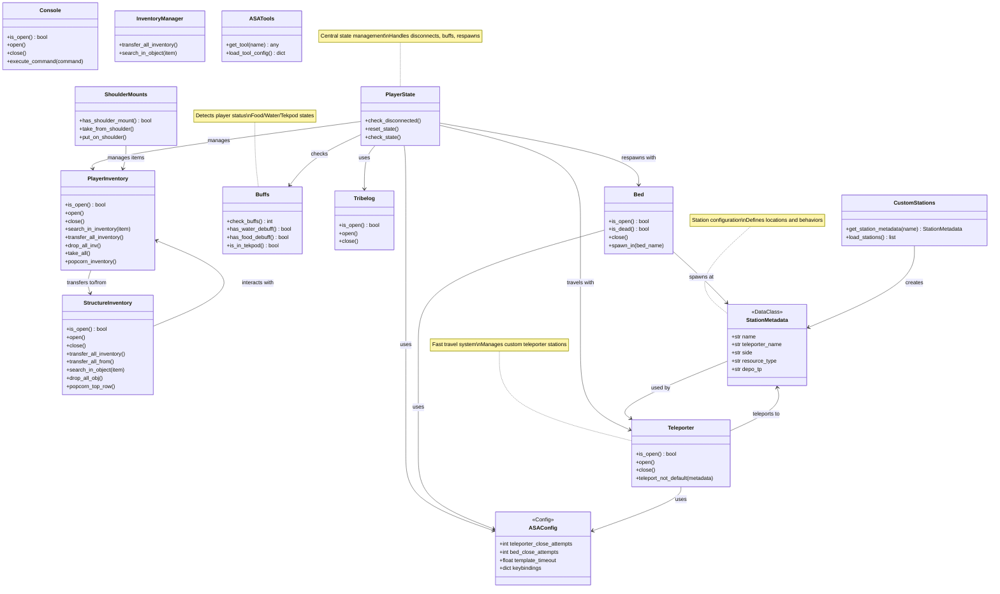

# Domain Layer (ASA) - Class Diagram

This layer contains ARK: Survival Ascended specific game logic and domain models.

## Component Details

### Player Module

#### PlayerState
- **Purpose**: Central player state management
- **Responsibilities**: 
  - Disconnect detection and auto-reconnect
  - State reset between tasks
  - Buff checking (food/water/tekpod)
  - Automatic respawn on death

#### PlayerInventory
- **Purpose**: Player inventory management
- **Features**: Search, transfer, drop operations
- **Special**: "Popcorn" function for rapid item manipulation

#### Buffs
- **Purpose**: Status effect detection via template matching
- **Return Values**: 
  - 0: Normal state
  - 1: In Tekpod
  - 2: Water debuff
  - 3: Food debuff

#### Console
- **Purpose**: In-game console command execution
- **Usage**: Admin commands, debugging

#### Tribelog
- **Purpose**: Check tribe activity log
- **Usage**: Monitoring game events

### Structures Module

#### Bed
- **Purpose**: Spawn point management
- **Features**: 
  - Death detection
  - Specific bed spawning
  - Spawn menu navigation

#### Teleporter
- **Purpose**: Fast travel system
- **Features**: 
  - Custom teleporter stations
  - Metadata-driven teleportation
  - Location management

#### StructureInventory
- **Purpose**: Container/structure inventory access
- **Supported**: Crop plots, forges, vaults, dedicated storage, grinders
- **Operations**: Transfer, search, drop operations

### Stations Module

#### CustomStations
- **Purpose**: Station configuration management
- **Storage**: JSON-based station definitions
- **Features**: Name-based station lookup

#### StationMetadata
- **Purpose**: Station configuration data class
- **Contains**: Name, teleporter, direction, resource type

### Dinosaurs Module

#### ShoulderMounts
- **Purpose**: Manage creatures on player's shoulder
- **Creatures**: Owl pellets, crystals from shoulder pets
- **Integration**: Works with player inventory

### Configuration

#### ASAConfig
- **Purpose**: ARK-specific configuration constants
- **Contains**: Retry attempts, timeouts, keybindings

#### ASATools
- **Purpose**: Tool-specific configurations
- **Usage**: Crafting, resource gathering tools
