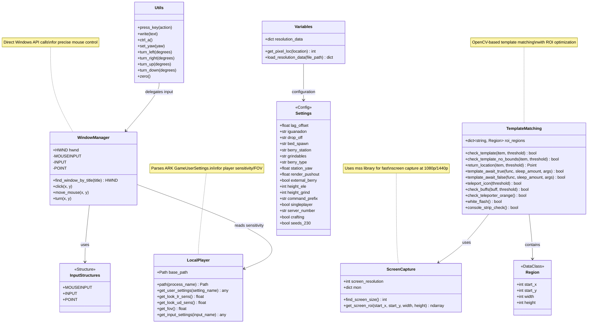

# Infrastructure Layer - Class Diagram

This layer provides low-level technical services for screen capture, input control, and template matching.

## Component Details

### ScreenCapture
- **Purpose**: Fast screen capture using `mss` library
- **Resolution Support**: 1080p (1920x1080) and 1440p (2560x1440)
- **ROI Support**: Captures specific screen regions for performance

### WindowManager
- **Purpose**: Direct Windows API input control
- **Features**: Pixel-perfect mouse movement, click simulation, raw input
- **Integration**: Reads player sensitivity from game settings via LocalPlayer

### TemplateMatching
- **Purpose**: OpenCV-based image recognition for game UI detection
- **ROI Optimization**: Pre-defined regions for each UI element
- **Async Support**: Template await functions for state changes

### LocalPlayer
- **Purpose**: Reads ARK game configuration files
- **Configuration**: Parses GameUserSettings.ini for sensitivity, FOV, keybinds
- **Path Discovery**: Dynamically finds ARK installation path

### Utils
- **Purpose**: High-level input abstraction
- **Features**: Camera control, keyboard input, text writing

### Settings & Variables
- **Purpose**: Global configuration and coordinate management
- **Storage**: JSON files for resolution-specific coordinates
- **Dynamic**: Resolution-aware coordinate scaling
