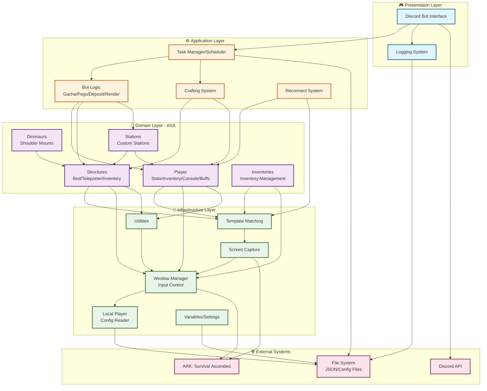

# ARK Gacha Bot - Layer Architecture Diagram

## System Architecture

This document describes the layered architecture of the ARK Gacha Bot application.

## Layer Descriptions

### 🎮 Presentation Layer
Handles user interaction and system output:
- **Discord Bot**: Command interface for remote control
- **Logging System**: Structured logging with Discord integration

### ⚙️ Application Layer
Orchestrates business workflows and bot behaviors:
- **Task Manager**: Priority-based task scheduling with execution time management
- **Bot Logic**: Core automation (Gacha farming, Pego collection, resource deposit, rendering)
- **Crafting System**: Automated crafting workflows (ARB modules)
- **Reconnect System**: Automatic game reconnection and session recovery

### 🎯 Domain Layer (ASA)
Game-specific domain logic for ARK: Survival Ascended:
- **Player**: Character state, inventory, console commands, buffs, tribelog
- **Structures**: Beds, teleporters, structure inventories
- **Dinosaurs**: Shoulder mounts and creature interactions
- **Stations**: Custom station definitions and metadata
- **Inventories**: Inventory management and item transfers

### 🔧 Infrastructure Layer
Low-level technical services:
- **Screen Capture**: Screenshot and ROI extraction using mss
- **Template Matching**: OpenCV-based image recognition
- **Window Manager**: Direct Windows API input (mouse/keyboard)
- **Utilities**: Shared helper functions
- **Local Player**: Game settings parser (GameUserSettings.ini)
- **Variables/Settings**: Configuration management

### 🌐 External Systems
- **ARK: Survival Ascended**: The game being automated
- **Discord API**: Remote command and control interface
- **File System**: JSON configuration and log storage
