# Presentation Layer - Class Diagram

This layer handles user interaction through Discord and system logging.

```mermaid
classDiagram
    %% Discord Bot
    class DiscordBot {
        -Bot bot
        -str command_prefix
        -int log_channel_gacha
        +on_ready()
        +send_new_logs()
    }
    
    %% Discord Commands
    class GachaCommands {
        +add_gacha(name, teleporter, resource_type, direction)
        +remove_gacha(name)
        +list_gachas()
        +update_gacha(name, property, value)
    }
    
    class PegoCommands {
        +add_pego(name, teleporter, delay)
        +remove_pego(name)
        +list_pegos()
    }
    
    class StationCommands {
        +add_station(name, type, config)
        +remove_station(name)
        +list_stations()
    }
    
    class ControlCommands {
        +start_bot()
        +stop_bot()
        +pause_bot()
        +resume_bot()
        +status()
    }
    
    class ConfigCommands {
        +get_config(setting)
        +set_config(setting, value)
        +reload_config()
    }
    
    %% Logging System
    class GachaLogger {
        -Logger logger
        +debug(message)
        +info(message)
        +warning(message)
        +error(message)
        +critical(message)
        +log_gacha_collection(station, items)
        +log_pego_collection(station, crystals)
    }
    
    class DiscordLogger {
        -int log_channel
        +send_log_to_discord(message)
        +send_error_to_discord(error)
        +format_log_message(level, message) str
    }
    
    class BotOptions {
        +load_options() dict
        +save_options(options)
        +get_option(key) any
        +set_option(key, value)
    }
    
    class LogFile {
        -str file_path
        +write_log(message)
        +read_logs(lines) list
        +clear_logs()
        +get_last_position() int
    }
    
    %% JSON Data Management
    class JSONManager {
        +load_json(json_file) dict
        +save_json(json_file, data)
        +validate_json(json_file, schema) bool
    }
    
    class GachaJSON {
        -str file_path
        +get_all_gachas() list
        +add_gacha(gacha_data)
        +remove_gacha(name)
        +update_gacha(name, data)
    }
    
    class PegoJSON {
        -str file_path
        +get_all_pegos() list
        +add_pego(pego_data)
        +remove_pego(name)
    }
    
    class StationsJSON {
        -str file_path
        +get_all_stations() list
        +add_station(station_data)
        +remove_station(name)
    }
    
    class VaultsJSON {
        -str file_path
        +get_vault_config(name) dict
        +set_vault_config(name, config)
    }
    
    class ResolutionJSON {
        -str file_path
        +get_resolution_data(resolution) dict
        +add_coordinate(name, x, y)
    }
    
    class ConsoleJSON {
        -str file_path
        +get_console_commands() list
        +add_command(command)
    }
    
    %% Relationships - Discord
    DiscordBot --> GachaCommands : handles
    DiscordBot --> PegoCommands : handles
    DiscordBot --> StationCommands : handles
    DiscordBot --> ControlCommands : handles
    DiscordBot --> ConfigCommands : handles
    DiscordBot --> DiscordLogger : logs to
    
    %% Relationships - Commands to JSON
    GachaCommands --> GachaJSON : reads/writes
    PegoCommands --> PegoJSON : reads/writes
    StationCommands --> StationsJSON : reads/writes
    ConfigCommands --> BotOptions : reads/writes
    
    %% Relationships - Logging
    GachaLogger --> LogFile : writes to
    GachaLogger --> DiscordLogger : sends to
    DiscordLogger --> DiscordBot : uses channel
    
    %% Relationships - JSON Management
    JSONManager --> GachaJSON : manages
    JSONManager --> PegoJSON : manages
    JSONManager --> StationsJSON : manages
    JSONManager --> VaultsJSON : manages
    JSONManager --> ResolutionJSON : manages
    JSONManager --> ConsoleJSON : manages
    
    %% Notes
    note for DiscordBot "Remote control interface\nCommand prefix: % (configurable)"
    note for GachaLogger "Multi-target logging:\n- File (logs.txt)\n- Discord channel\n- Console output"
    note for JSONManager "Persistence layer\nManages all bot configuration"
    note for ControlCommands "Bot lifecycle control\nStart/Stop/Pause/Resume"
```



## Component Details

### Discord Bot

#### DiscordBot
- **Purpose**: Discord.py bot for remote control
- **Prefix**: Configurable (default: `%`)
- **Features**:
  - Command handling
  - Async log streaming
  - Multi-channel support
- **Intents**: Default intents (message content required)

### Discord Commands

#### GachaCommands
- **Commands**:
  - `%add_gacha <name> <teleporter> <resource_type> <direction>`: Add gacha station
  - `%remove_gacha <name>`: Remove gacha station
  - `%list_gachas`: List all configured gachas
  - `%update_gacha <name> <property> <value>`: Update gacha settings

#### PegoCommands
- **Commands**:
  - `%add_pego <name> <teleporter> <delay>`: Add pego station
  - `%remove_pego <name>`: Remove pego station
  - `%list_pegos`: List all configured pegos

#### StationCommands
- **Commands**:
  - `%add_station <name> <type> <config>`: Add custom station
  - `%remove_station <name>`: Remove station
  - `%list_stations`: List all stations

#### ControlCommands
- **Commands**:
  - `%start`: Start bot task execution
  - `%stop`: Stop all tasks
  - `%pause`: Pause task scheduler
  - `%resume`: Resume task scheduler
  - `%status`: Show bot status and queue

#### ConfigCommands
- **Commands**:
  - `%get_config <setting>`: Get configuration value
  - `%set_config <setting> <value>`: Set configuration value
  - `%reload_config`: Reload configuration from files

### Logging System

#### GachaLogger
- **Purpose**: Structured logging for bot operations
- **Levels**: DEBUG, INFO, WARNING, ERROR, CRITICAL
- **Special Methods**:
  - `log_gacha_collection()`: Log gacha farming results
  - `log_pego_collection()`: Log pego crystal collection
- **Output**: Multi-target (file, console, Discord)

#### DiscordLogger
- **Purpose**: Discord integration for logs
- **Features**:
  - Real-time log streaming
  - Error notifications
  - Formatted log messages
- **Channel**: Configurable log channel ID

#### BotOptions
- **Purpose**: Bot settings persistence
- **Storage**: JSON file
- **Settings**: Runtime options, feature flags

#### LogFile
- **Purpose**: File-based log management
- **File**: `logs/logs.txt`
- **Features**:
  - Append-only writes
  - Last position tracking for streaming
  - Log rotation support

### JSON Data Management

#### JSONManager
- **Purpose**: Centralized JSON file management
- **Features**:
  - Schema validation
  - Atomic writes
  - Error handling
- **Thread Safety**: File locking for concurrent access

#### GachaJSON
- **File**: `json_files/gacha.json`
- **Structure**:
```json
[
  {
    "name": "Gacha1",
    "teleporter": "GACHATP1",
    "side": "right",
    "resource_type": "crystals"
  }
]
```

#### PegoJSON
- **File**: `json_files/pego.json`
- **Structure**:
```json
[
  {
    "name": "Pego1",
    "teleporter": "PEGOTP1",
    "delay": 7200
  }
]
```

#### StationsJSON
- **File**: `json_files/stations.json`
- **Purpose**: Custom station definitions
- **Structure**:
```json
{
  "GACHATP1": {
    "bed_name": "GACHATP1",
    "yaw": 180.0,
    "bed_x": 1280,
    "bed_y": 720
  }
}
```

#### VaultsJSON
- **File**: `json_files/vaults.json`
- **Purpose**: Vault deposit configuration
- **Structure**:
```json
{
  "vault1": {
    "items": ["Metal Ingot", "Polymer"],
    "priority": 1
  }
}
```

#### ResolutionJSON
- **File**: `json_files/resolution.json`
- **Purpose**: Resolution-specific UI coordinates
- **Resolutions**: 1080p and 1440p

#### ConsoleJSON
- **File**: `json_files/console.json`
- **Purpose**: Console command presets

## Data Flow

1. **User → Discord**: User sends command via Discord
2. **Discord → Command Handler**: Bot parses and validates command
3. **Command Handler → JSON**: Updates configuration files
4. **Task Scheduler**: Picks up configuration changes
5. **Bot Logic → Logger**: Logs execution details
6. **Logger → Discord**: Streams logs back to Discord channel
7. **Logger → File**: Persists logs to disk

## Configuration Management

All bot configuration is stored in JSON files:
- **json_files/gacha.json**: Gacha stations
- **json_files/pego.json**: Pego stations
- **json_files/stations.json**: Teleporter stations
- **json_files/vaults.json**: Vault deposit config
- **json_files/resolution.json**: UI coordinates
- **json_files/console.json**: Console commands

Changes via Discord commands immediately persist and take effect on next task execution.
